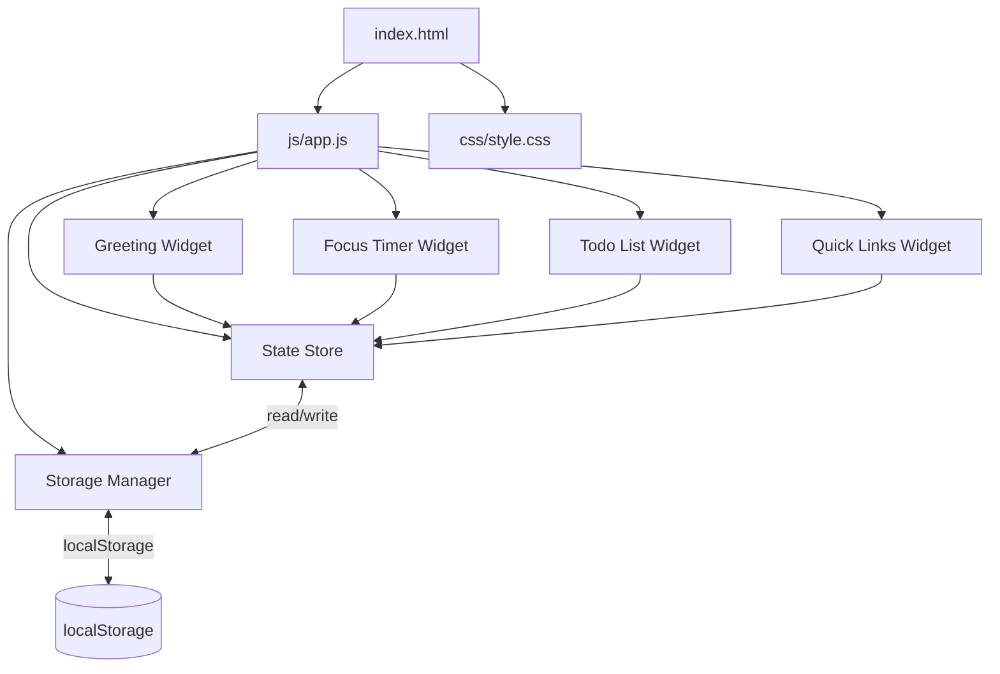
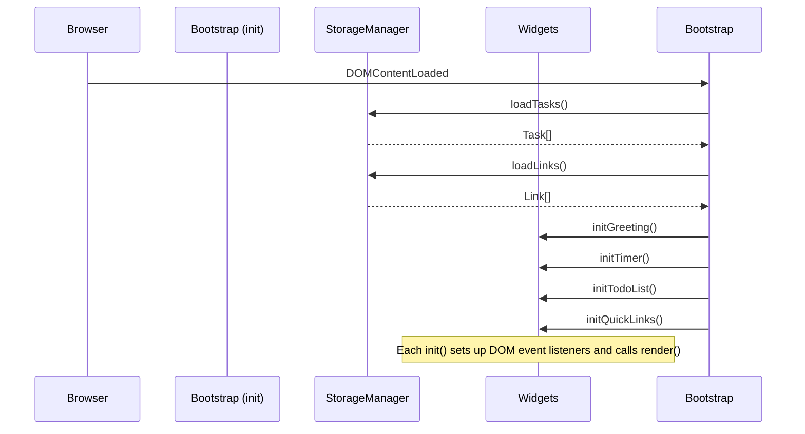
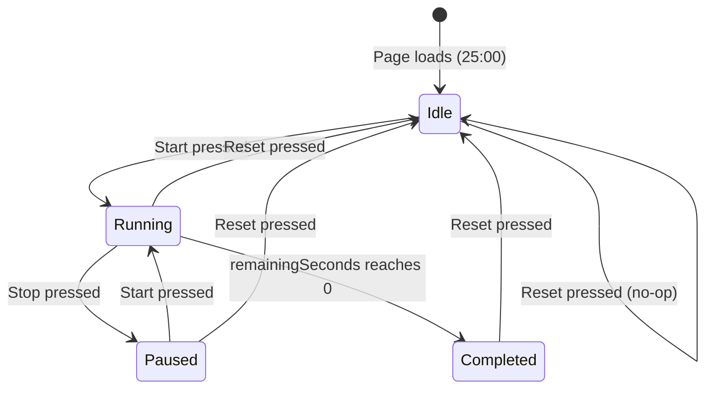

# Design Document: To-do-List Life Dashboard

## Overview

The To-do-List Life Dashboard is a zero-dependency, client-side single-page application (SPA). A single `index.html` file bootstraps the entire experience; one CSS file styles it, and one JavaScript file drives all behavior. There is no build step, no module bundler, and no server. The application opens directly via the `file://` protocol in any modern browser.

The application is divided into four self-contained widgets that share a common state store (in-memory JavaScript objects kept in sync with `localStorage`) and a shared rendering pipeline (each widget owns a `render()` function that re-paints its DOM subtree from the current state).

### Design Goals

- **Zero external dependencies** — no CDN, no npm packages, no ES modules.
- **Single source of truth** — in-memory state objects are the canonical representation; `localStorage` is a persistence mirror.
- **Predictable rendering** — every widget has one `render()` function that is a pure function of its slice of state.
- **Fault isolation** — a `localStorage` failure must never crash the application; errors are surfaced to the UI and the in-memory state continues to be used for the current session.

---

## Architecture

### High-Level Component Diagram



### Module Sections in `js/app.js`

Because the project uses a single flat JavaScript file (no `import`/`export`), the file is organized into clearly demarcated logical sections using block comments. Each section owns a cohesive set of functions.

```
js/app.js
├── 1. CONSTANTS & CONFIGURATION
├── 2. UTILITY HELPERS
│   ├── formatTime(date)          → "HH:MM:SS"
│   ├── formatDate(date)          → "Weekday, D Month YYYY"
│   ├── getGreeting(date)         → "Good Morning | Afternoon | Evening | Day"
│   ├── formatTimer(seconds)      → "MM:SS"
│   ├── isValidTaskInput(str)     → boolean
│   ├── isValidURL(str)           → boolean
│   └── isValidLinkInput(l, u)    → boolean
├── 3. STORAGE MANAGER
│   ├── loadTasks()               → Task[]
│   ├── saveTasks(tasks)          → void
│   ├── loadLinks()               → Link[]
│   └── saveLinks(links)          → void
├── 4. STATE STORE
│   ├── state.tasks               → Task[]
│   ├── state.links               → Link[]
│   └── state.timer               → TimerState
├── 5. GREETING WIDGET
│   ├── initGreeting()
│   └── renderGreeting()
├── 6. FOCUS TIMER WIDGET
│   ├── initTimer()
│   ├── renderTimer()
│   ├── startTimer()
│   ├── stopTimer()
│   └── resetTimer()
├── 7. TODO LIST WIDGET
│   ├── initTodoList()
│   ├── renderTodoList()
│   ├── addTask(text)
│   ├── editTask(id, newText)
│   ├── toggleTask(id)
│   └── deleteTask(id)
├── 8. QUICK LINKS WIDGET
│   ├── initQuickLinks()
│   ├── renderQuickLinks()
│   ├── addLink(label, url)
│   └── deleteLink(id)
└── 9. APP BOOTSTRAP
    └── init()
```

### Initialization Flow



---

## Components and Interfaces

### Greeting Widget

**Responsibilities:** Display the live clock, full date string, and time-based greeting. Update once per second via `setInterval`.

**DOM Structure:**
```
#greeting-widget
  ├── #greeting-message   ← "Good Morning / Afternoon / Evening"
  ├── #clock-display      ← "14:32:07"
  └── #date-display       ← "Monday, 7 September 2026"
```

**Functions:**
- `initGreeting()` — starts a 1-second interval that calls `renderGreeting()`.
- `renderGreeting()` — reads `new Date()`, computes all three values, and sets the `textContent` of the three elements. On clock failure, sets placeholder text.

---

### Focus Timer Widget

**Responsibilities:** Manage a 25-minute countdown timer with Start, Stop, and Reset controls.

**DOM Structure:**
```
#timer-widget
  ├── #timer-display      ← "25:00"
  └── #timer-controls
      ├── #btn-start
      ├── #btn-stop
      └── #btn-reset
```

**Functions:**
- `initTimer()` — sets up button event listeners, calls `renderTimer()`.
- `renderTimer()` — updates `#timer-display` and sets button `disabled` states based on `state.timer`.
- `startTimer()` — transitions state to `Running`, starts a 1-second `setInterval`.
- `stopTimer()` — clears the interval, transitions state to `Paused`.
- `resetTimer()` — clears any interval, resets `state.timer` to initial Idle values, calls `renderTimer()`.

---

### Todo List Widget

**Responsibilities:** CRUD operations on tasks, with inline editing, completion toggling, deletion confirmation, and `localStorage` persistence.

**DOM Structure:**
```
#todo-widget
  ├── #todo-input-area
  │   ├── #todo-input      ← text input, max 500 chars
  │   ├── #btn-add-task
  │   └── #todo-input-error  ← inline error message
  └── #todo-list           ← <ul>
      └── .task-item (repeated)
          ├── .task-checkbox
          ├── .task-text   ← span OR inline edit input
          ├── .btn-edit
          ├── .btn-delete
          └── .task-error  ← per-item inline error
```

**Functions:**
- `initTodoList()` — loads tasks from storage into state, sets up event delegation on `#todo-list` and the add button, calls `renderTodoList()`.
- `renderTodoList()` — replaces the `innerHTML` of `#todo-list` with one `<li>` per task in `state.tasks`.
- `addTask(text)` — validates, creates Task, appends to `state.tasks`, calls `saveTasks()`, re-renders.
- `editTask(id, newText)` — validates, mutates the task in `state.tasks`, calls `saveTasks()`, re-renders.
- `toggleTask(id)` — flips `task.completed`, calls `saveTasks()`, re-renders.
- `deleteTask(id)` — shows `window.confirm`, on confirmation removes from `state.tasks`, calls `saveTasks()`, re-renders.

---

### Quick Links Widget

**Responsibilities:** Display, add, and delete URL shortcuts that open in a new browser tab.

**DOM Structure:**
```
#quicklinks-widget
  ├── #quicklinks-input-area
  │   ├── #link-label-input   ← max 100 chars
  │   ├── #link-url-input     ← max 2048 chars
  │   ├── #btn-add-link
  │   └── #quicklinks-error
  └── #quicklinks-list        ← <ul>
      ├── .empty-state        ← shown when list is empty
      └── .link-item (repeated)
          ├── .link-button    ← opens URL in new tab
          └── .btn-delete-link
```

**Functions:**
- `initQuickLinks()` — loads links from storage, sets up event listeners, calls `renderQuickLinks()`.
- `renderQuickLinks()` — replaces the `innerHTML` of `#quicklinks-list`.
- `addLink(label, url)` — validates, creates Link, appends to `state.links`, calls `saveLinks()`, re-renders.
- `deleteLink(id)` — removes from `state.links`, calls `saveLinks()`, re-renders.

---

## Data Models

### Task Object

```js
{
  id:        string,   // Unique identifier, generated with Date.now() + Math.random()
  title:     string,   // Trimmed task description, 1–500 characters
  completed: boolean   // false by default
}
```

**Generation:** `id` is generated at creation time and never mutated. `id` is included in the serialized JSON so that tasks survive a round-trip through `localStorage` with their identity intact.

### Link Object

```js
{
  id:    string,   // Unique identifier, same generation strategy as Task.id
  label: string,   // User-defined button label, 1–100 characters
  url:   string    // Full URL, must begin with "http://" or "https://", max 2048 chars
}
```

### TimerState Object (in-memory only — not persisted)

```js
{
  status:          "Idle" | "Running" | "Paused" | "Completed",
  remainingSeconds: number,   // 0–1500 (25 * 60), starts at 1500
  intervalId:      number | null  // return value of setInterval, null when not running
}
```

### In-Memory State Store

```js
const state = {
  tasks:  [],    // Task[]
  links:  [],    // Link[]
  timer:  {
    status:           "Idle",
    remainingSeconds: 1500,
    intervalId:       null
  }
};
```

---

## localStorage Schema

| Key          | Value Type    | Description                                      |
|--------------|---------------|--------------------------------------------------|
| `"tasks"`    | JSON string   | Serialized array of Task objects                 |
| `"quickLinks"` | JSON string | Serialized array of Link objects                 |

**Serialization format for `"tasks"`:**
```json
[
  { "id": "1720000000000.123", "title": "Buy groceries", "completed": false },
  { "id": "1720000001000.456", "title": "Write report", "completed": true }
]
```

**Serialization format for `"quickLinks"`:**
```json
[
  { "id": "1720000002000.789", "label": "GitHub", "url": "https://github.com" },
  { "id": "1720000003000.012", "label": "MDN", "url": "https://developer.mozilla.org" }
]
```

**Read procedure:**
1. `localStorage.getItem(key)` — returns `null` if absent.
2. If `null`, return `[]` (empty list, no error).
3. `JSON.parse(value)` — if this throws, log the error, discard, return `[]`.
4. Validate that the result is an array; if not, return `[]`.
5. Return the parsed array.

**Write procedure:**
1. `JSON.stringify(list)`.
2. `localStorage.setItem(key, serialized)` — wrap in `try/catch`.
3. On `catch`, surface the error to the UI layer (pass error details back to the calling widget function).

---

## JavaScript Module Structure

Since the entire application lives in a single `app.js` file, internal organization is enforced through comments and consistent naming conventions rather than ES modules.

### Section 1 — Constants & Configuration

```js
const STORAGE_KEY_TASKS  = "tasks";
const STORAGE_KEY_LINKS  = "quickLinks";
const TIMER_DURATION     = 25 * 60;   // 1500 seconds
const MAX_TASK_LENGTH    = 500;
const MAX_LABEL_LENGTH   = 100;
const MAX_URL_LENGTH     = 2048;
const DAYS    = ["Sunday","Monday","Tuesday","Wednesday","Thursday","Friday","Saturday"];
const MONTHS  = ["January","February","March","April","May","June",
                 "July","August","September","October","November","December"];
```

### Section 2 — Utility Helpers

Pure functions with no side effects. These are the primary targets for property-based testing.

```
formatTime(date)        — pads hours, minutes, seconds to 2 digits with leading zero
formatDate(date)        — constructs "Weekday, D Month YYYY" string
getGreeting(date)       — maps hour to greeting string
formatTimer(seconds)    — converts integer seconds to "MM:SS" string
isValidTaskInput(str)   — returns false for null, empty, or whitespace-only strings
isValidURL(str)         — returns true only if str starts with "http://" or "https://"
isValidLinkInput(l,u)   — returns false if label or URL is empty/whitespace, or URL is invalid
```

### Section 3 — Storage Manager

```
loadTasks()    — reads "tasks" key, parses JSON, returns Task[]
saveTasks(arr) — serializes to JSON, writes to localStorage; throws on failure
loadLinks()    — reads "quickLinks" key, parses JSON, returns Link[]
saveLinks(arr) — serializes to JSON, writes to localStorage; throws on failure
```

### Section 4 — State Store

The single `state` object (defined at module scope). No direct external mutation — all writes go through the widget functions which then call the Storage Manager.

### Sections 5–8 — Widget Modules

Each widget section follows the same pattern:
1. `init*()` — bind DOM event listeners, call `render*()`.
2. `render*()` — read from `state`, generate HTML string, assign to container's `innerHTML` (or update individual element properties for performance-critical paths like the clock).
3. Action functions (`add*`, `edit*`, `toggle*`, `delete*`) — validate input → mutate state → call storage → call `render*()`.

### Section 9 — Bootstrap

```js
document.addEventListener("DOMContentLoaded", function () {
  state.tasks = loadTasks();
  state.links = loadLinks();
  initGreeting();
  initTimer();
  initTodoList();
  initQuickLinks();
});
```

---

## HTML Structure Overview

```html
<!DOCTYPE html>
<html lang="en">
<head>
  <meta charset="UTF-8">
  <meta name="viewport" content="width=device-width, initial-scale=1.0">
  <title>Life Dashboard</title>
  <link rel="stylesheet" href="css/style.css">
</head>
<body>
  <main class="dashboard">

    <section id="greeting-widget" class="widget">
      <div id="greeting-message"></div>
      <div id="clock-display"></div>
      <div id="date-display"></div>
    </section>

    <section id="timer-widget" class="widget">
      <h2>Focus Timer</h2>
      <div id="timer-display">25:00</div>
      <div id="timer-controls">
        <button id="btn-start">Start</button>
        <button id="btn-stop"  disabled>Stop</button>
        <button id="btn-reset">Reset</button>
      </div>
    </section>

    <section id="todo-widget" class="widget">
      <h2>To-Do List</h2>
      <div id="todo-input-area">
        <input type="text" id="todo-input" maxlength="500" placeholder="Add a task…">
        <button id="btn-add-task">Add</button>
        <p id="todo-input-error" class="error" aria-live="polite"></p>
      </div>
      <ul id="todo-list"></ul>
    </section>

    <section id="quicklinks-widget" class="widget">
      <h2>Quick Links</h2>
      <div id="quicklinks-input-area">
        <input type="text" id="link-label-input" maxlength="100" placeholder="Label">
        <input type="url"  id="link-url-input"   maxlength="2048" placeholder="https://…">
        <button id="btn-add-link">Add Link</button>
        <p id="quicklinks-error" class="error" aria-live="polite"></p>
      </div>
      <ul id="quicklinks-list"></ul>
    </section>

  </main>
  <script src="js/app.js"></script>
</body>
</html>
```

Key constraints satisfied:
- No `<style>` blocks.
- No inline `<script>` blocks.
- No external CDN `<link>` or `<script>` tags.
- Exactly one `<link rel="stylesheet">` and one `<script src>`.

---

## CSS Architecture Overview

### File: `css/style.css`

**Layout strategy:** CSS Grid for the dashboard-level layout (2-column on wider viewports, 1-column on narrow viewports). Each widget uses Flexbox internally.

```css
/* Responsive grid */
.dashboard {
  display: grid;
  grid-template-columns: repeat(auto-fit, minmax(300px, 1fr));
  gap: 1.5rem;
  padding: 1.5rem;
}

/* Fluid typography (clamp) ensures min 12px body font */
body { font-size: clamp(12px, 1.5vw, 16px); }
```

**Visual hierarchy sizes** (satisfying Requirement 15.3):
- Heading (`h2`): `1.5rem` (~24px at base)
- Label / sub-heading: `1.125rem` (~18px at base)
- Body text: `1rem` (≥12px after clamp)

**Theming approach:** CSS custom properties on `:root` for colours and spacing, making future theming easy without introducing a preprocessor.

```css
:root {
  --color-bg:      #f8f9fa;
  --color-surface: #ffffff;
  --color-primary: #4a6fa5;
  --color-text:    #212529;
  --color-muted:   #6c757d;
  --color-error:   #dc3545;
  --color-success: #28a745;
  --radius:        8px;
  --shadow:        0 2px 8px rgba(0,0,0,0.08);
  --spacing-sm:    0.5rem;
  --spacing-md:    1rem;
  --spacing-lg:    1.5rem;
}
```

**Widget styling approach:** Each widget section gets a `.widget` class (card-style: background, border-radius, box-shadow, padding). Widget-specific rules are scoped by ID (`#timer-widget`, `#todo-widget`, etc.).

**Completed task styling:**
```css
.task-item.completed .task-text {
  text-decoration: line-through;
  opacity: 0.5;
}
```

**Responsive breakpoints:**
- `>= 768px`: 2-column grid.
- `< 768px`: 1-column grid, full-width widgets.
- `320px–1920px`: guaranteed no horizontal scroll via `box-sizing: border-box` and `max-width: 100%` on all elements.

---

## State Management Approach

### Principles

1. **Single in-memory object** — `state` is the single source of truth during a session.
2. **Synchronous persistence** — every mutation calls the appropriate `save*()` function before returning to the event loop.
3. **Render after every mutation** — each action function ends with a `render*()` call so the DOM always reflects state.
4. **Optimistic UI with rollback** — for `localStorage` writes: the in-memory state is mutated first; if the write fails, the error is shown to the user but the state is NOT rolled back (the task/link remains visible for the session). Exception: for link creation failure (Requirement 11.6), the link is rolled back from state to match the spec.

### Mutation Flow

```
User Event
  → Input validation
  → Mutate state.*
  → save*(state.*)   [try/catch]
    → on error: showError(message)
  → render*()
```

### Timer State Machine



**State transitions and control states:**

| State     | Start btn | Stop btn | Tick processed? |
|-----------|-----------|----------|-----------------|
| Idle      | enabled   | disabled | no              |
| Running   | disabled  | enabled  | yes             |
| Paused    | enabled   | disabled | no              |
| Completed | disabled  | disabled | no              |

On entering **Completed**: clear interval, display "00:00", play `AudioContext` beep (or `new Audio()` tone), transition to Completed state.

On **Reset** from any state: clear interval (if active), set `remainingSeconds = TIMER_DURATION`, set `status = "Idle"`, call `renderTimer()`.

---

## Error Handling Patterns

### localStorage Failures

All `localStorage` calls are wrapped in `try/catch`. The pattern is:

```js
function saveTasks(tasks) {
  try {
    localStorage.setItem(STORAGE_KEY_TASKS, JSON.stringify(tasks));
  } catch (e) {
    throw new Error("Storage unavailable: " + e.message);
  }
}
```

Calling widget functions catch this error and call a shared `showError(elementId, message)` helper that sets the `textContent` of a designated error `<p>` element and adds a visible CSS class. Errors auto-clear on the next successful operation.

### Invalid JSON on Load

```js
function loadTasks() {
  var raw = localStorage.getItem(STORAGE_KEY_TASKS);
  if (raw === null) return [];
  try {
    var parsed = JSON.parse(raw);
    return Array.isArray(parsed) ? parsed : [];
  } catch (e) {
    console.error("Corrupted task data discarded:", e);
    return [];
  }
}
```

### Input Validation Errors

Shown inline using a dedicated `<p class="error">` element adjacent to the relevant input. The element is empty and hidden by default; it receives a text message and becomes visible on validation failure, then is cleared on the next valid interaction.

### URL Validation

```js
function isValidURL(str) {
  return typeof str === "string" &&
    (str.startsWith("http://") || str.startsWith("https://"));
}
```

---

## Correctness Properties

*A property is a characteristic or behavior that should hold true across all valid executions of a system — essentially, a formal statement about what the system should do. Properties serve as the bridge between human-readable specifications and machine-verifiable correctness guarantees.*

### Property Reflection

After reviewing all prework-identified properties, the following consolidations apply:
- **2.1–2.4** (greeting per time range) can be expressed as a single comprehensive property covering all hours.
- **4.5–4.6** (button disabled states per timer status) can be expressed as a single invariant property.
- **6.3** (edit updates title) subsumes **6.4** (edit persists) — storage is covered by the Task round-trip property (9.8).
- **6.6** (invalid edit text) is subsumed by **5.6** — the same `isValidTaskInput` function covers both.
- **7.2 / 7.3** (toggle) are expressed as a single involution (round-trip) property.
- **11.4** (empty label/URL rejected) and **10.6 / 11.5** (invalid URL rejected) can be expressed as two independent input-validation properties.
- **13.5** (Link round-trip) and **9.8** (Task round-trip) are kept distinct as they cover different data types.

---

### Property 1: Time formatter produces valid HH:MM:SS strings

*For any* valid `Date` object, `formatTime(date)` SHALL return a string matching the pattern `HH:MM:SS` where HH is in [00, 23], MM is in [00, 59], and SS is in [00, 59].

**Validates: Requirements 1.1**

---

### Property 2: Date formatter includes all four required components

*For any* valid `Date` object, `formatDate(date)` SHALL return a string that contains the full weekday name, a numeric day (1–31), the full month name, and a 4-digit year, all derived from the date's local representation.

**Validates: Requirements 1.2**

---

### Property 3: Greeting maps every hour to the correct message

*For any* hour value H in [0, 23], `getGreeting` SHALL return:
- `"Good Morning"` when H is in [5, 11],
- `"Good Afternoon"` when H is in [12, 17],
- `"Good Evening"` when H is in [18, 23] or [0, 4].

**Validates: Requirements 2.1, 2.2, 2.3, 2.4**

---

### Property 4: Timer formatter produces valid MM:SS strings

*For any* integer `n` in [0, 1500], `formatTimer(n)` SHALL return a string matching the pattern `MM:SS` where MM is in [00, 25] and SS is in [00, 59], accurately representing `n` seconds.

**Validates: Requirements 3.3**

---

### Property 5: Each timer tick decrements remaining seconds by exactly one

*For any* `TimerState` in the `Running` state with `remainingSeconds > 0`, processing one Tick SHALL produce a new state where `remainingSeconds` is reduced by exactly 1 and the status remains `Running`.

**Validates: Requirements 3.2**

---

### Property 6: Timer control enabled/disabled states are an invariant of timer status

*For any* `TimerState` with status S, the enabled/disabled state of the Start, Stop, and Reset controls SHALL satisfy:
- `status = "Running"` → Start disabled, Stop enabled, Reset enabled.
- `status = "Idle" | "Paused"` → Start enabled, Stop disabled, Reset enabled.
- `status = "Completed"` → Start disabled, Stop disabled, Reset enabled.

**Validates: Requirements 4.5, 4.6**

---

### Property 7: Task creation produces a task with trimmed title and incomplete status

*For any* non-whitespace string `s`, `createTask(s)` SHALL return a Task where `task.title === s.trim()` and `task.completed === false`.

**Validates: Requirements 5.2**

---

### Property 8: Whitespace-only and empty strings are invalid task input

*For any* string `s` composed entirely of whitespace characters (or the empty string), `isValidTaskInput(s)` SHALL return `false`.

**Validates: Requirements 5.6, 6.6**

---

### Property 9: Task completion toggle is an involution (round-trip)

*For any* Task `T`, applying `toggleTask` twice SHALL produce a task whose `completed` value is identical to `T.completed`. That is: `toggleTask(toggleTask(T)).completed === T.completed`.

**Validates: Requirements 7.2, 7.3**

---

### Property 10: Task list serialization round-trip preserves all fields

*For any* valid Task list `L` (where each Task has an `id`, `title`, and `completed` field), `deserializeTasks(serializeTasks(L))` SHALL produce a list of the same length where each entry's `id`, `title`, and `completed` are strictly equal to the corresponding entry in `L`.

**Validates: Requirements 9.8, 9.6, 9.7**

---

### Property 11: Link list serialization round-trip preserves all fields

*For any* valid Link list `L` (where each Link has an `id`, `label`, and `url` field, with `url` beginning with `"http://"` or `"https://"`), `deserializeLinks(serializeLinks(L))` SHALL produce a list of the same length where each entry's `id`, `label`, and `url` are strictly equal to the corresponding entry in `L`.

**Validates: Requirements 13.5, 13.1, 13.2**

---

### Property 12: Strings not starting with http:// or https:// are invalid URLs

*For any* string `s` that does not begin with `"http://"` or `"https://"`, `isValidURL(s)` SHALL return `false`. Conversely, *for any* string `s` that does begin with `"http://"` or `"https://"`, `isValidURL(s)` SHALL return `true`.

**Validates: Requirements 10.6, 11.5**

---

### Property 13: Link creation produces a link with the provided label and URL

*For any* non-empty label string `L` and valid URL string `U`, `createLink(L, U)` SHALL return a Link where `link.label === L` and `link.url === U`.

**Validates: Requirements 11.2**

---

### Property 14: Empty or whitespace label or URL is invalid link input

*For any* label `L` or URL `U` that is empty or composed entirely of whitespace characters, `isValidLinkInput(L, U)` SHALL return `false`.

**Validates: Requirements 11.4**

---

### Property 15: renderQuickLinks produces exactly one button per Link

*For any* Link list `L`, `renderQuickLinks(L)` SHALL produce a DOM structure containing exactly `L.length` link buttons, where the button at index `i` displays `L[i].label` as its text content.

**Validates: Requirements 10.2**

---

## Error Handling

### Error Surface Points

| Location | Error Condition | User Feedback | State Effect |
|---|---|---|---|
| `addTask` | `saveTasks` throws | `#todo-input-error` — "Task could not be saved." | Task remains in `state.tasks` and UI |
| `editTask` | `saveTasks` throws | Per-item `.task-error` — "Change could not be saved." | Updated text remains in `state.tasks` and UI |
| `toggleTask` | `saveTasks` throws | Per-item `.task-error` — "Status could not be saved." | Toggled state remains in `state.tasks` and UI |
| `deleteTask` | `saveTasks` throws | Per-item `.task-error` — "Deletion could not be saved." | Task remains removed from UI and `state.tasks` |
| `addLink` | `saveLinks` throws | `#quicklinks-error` — "Link could not be saved." | Link removed from `state.links`, button removed from UI (rollback) |
| `deleteLink` | `saveLinks` throws | `#quicklinks-error` — "Deletion could not be saved." | Link re-added to `state.links`, button re-rendered |
| `loadTasks` | Invalid JSON | Silent (console.error) | Empty task list |
| `loadLinks` | Invalid JSON | `#quicklinks-error` on render | Empty link list |
| URL validation | Not http/https | Inline error on link button activation | No tab opened |

### `showError(elementId, message)` Helper

```js
function showError(elementId, message) {
  var el = document.getElementById(elementId);
  if (el) {
    el.textContent = message;
    el.style.display = "block";
  }
}

function clearError(elementId) {
  var el = document.getElementById(elementId);
  if (el) {
    el.textContent = "";
    el.style.display = "none";
  }
}
```

---

## Testing Strategy

### Dual Testing Approach

This feature uses a dual testing approach combining **property-based tests** for pure utility and business logic functions, and **unit/integration tests** for DOM interactions, state machine transitions, and error handling.

### Property-Based Testing

**Library:** [fast-check](https://github.com/dubzzz/fast-check) (JavaScript) — used in a Node.js test runner (Jest or Vitest with `--run` flag for single execution).

**Minimum iterations:** 100 per property test.

**Tag format:** Each property test is annotated with a comment:
```js
// Feature: todo-life-dashboard, Property N: <property text>
```

**Targets (15 properties defined above):**

| Property | Function Under Test | Generator Strategy |
|---|---|---|
| P1 | `formatTime` | Arbitrary valid Date objects |
| P2 | `formatDate` | Arbitrary valid Date objects |
| P3 | `getGreeting` | Integer hours 0–23 |
| P4 | `formatTimer` | Integer 0–1500 |
| P5 | Timer tick logic | TimerState objects in Running status |
| P6 | Timer control states | All four TimerState status values |
| P7 | `createTask` | Non-empty strings with arbitrary whitespace padding |
| P8 | `isValidTaskInput` | Whitespace-only strings (spaces, tabs, newlines) |
| P9 | `toggleTask` | Arbitrary Task objects |
| P10 | `serializeTasks` / `deserializeTasks` | Arbitrary Task arrays |
| P11 | `serializeLinks` / `deserializeLinks` | Arbitrary Link arrays |
| P12 | `isValidURL` | Strings with and without valid URL prefixes |
| P13 | `createLink` | Non-empty labels and valid URL strings |
| P14 | `isValidLinkInput` | Empty strings, whitespace strings, valid pairs |
| P15 | `renderQuickLinks` | Arbitrary Link arrays |

### Unit Tests

Focus areas:
- Timer state machine transitions (Idle → Running → Paused → Completed → Idle).
- `loadTasks` / `loadLinks` with `null`, invalid JSON, non-array values.
- `window.confirm` mock for delete confirmation flow.
- `localStorage` failure simulation (mock `setItem` to throw `QuotaExceededError`).
- Greeting widget clock unavailability fallback.
- Deletion confirmation cancel retains task.

### Integration Tests

- Full page initialization sequence (DOMContentLoaded → all widgets render).
- Timer completion triggers audio alert.
- Add task → appears in DOM within 100ms.
- Add link → button appears in DOM within 300ms.
- Delete link → button removed within 300ms.

### Testing Excluded from PBT

- UI rendering aesthetics and visual hierarchy (CSS constraints).
- `file://` protocol compatibility.
- Cross-browser rendering correctness.
- 2-second page load performance.
- 100ms UI response time.

These are addressed through manual browser testing and smoke tests.
